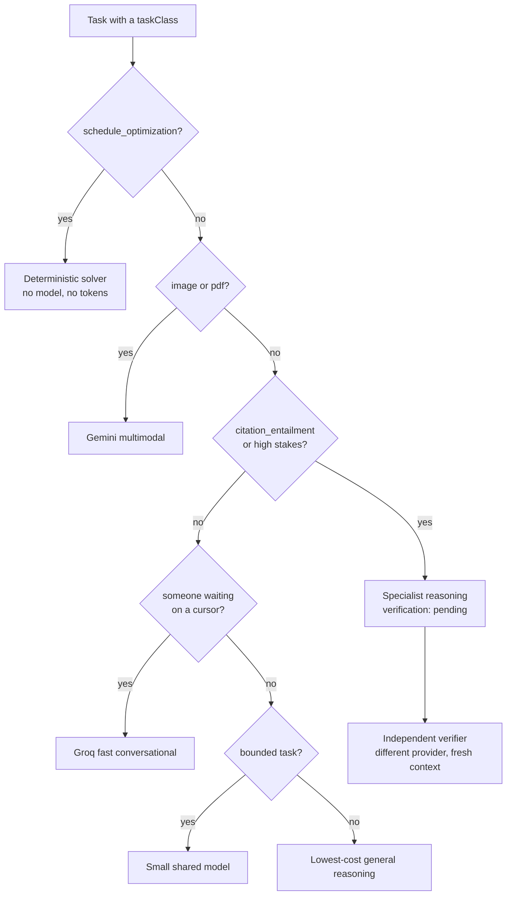
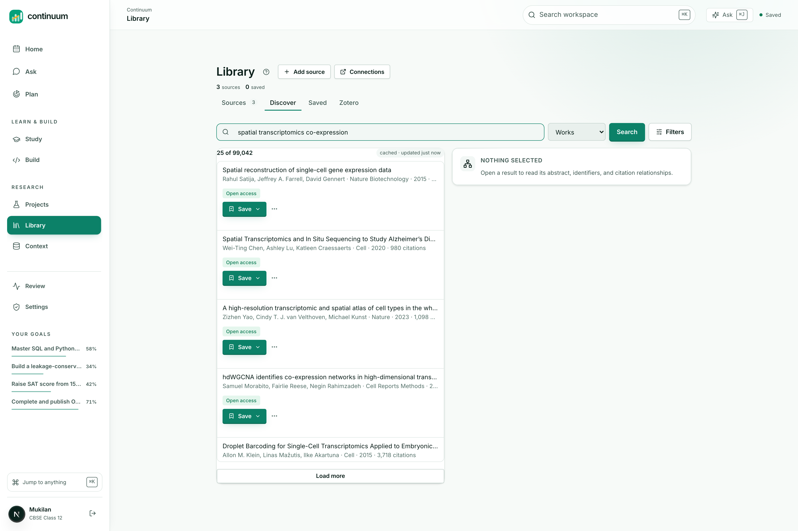
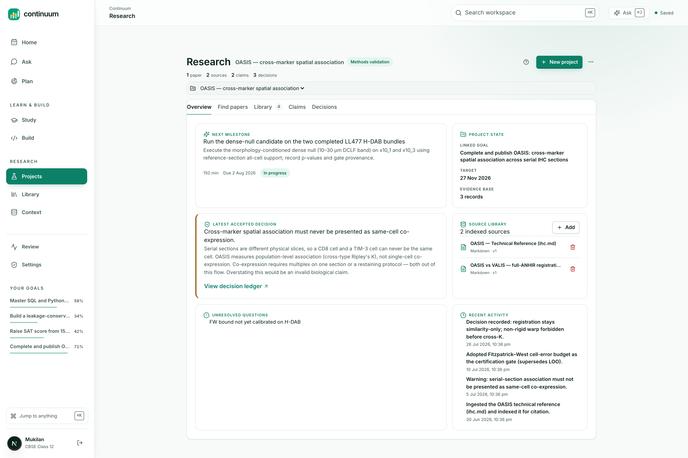
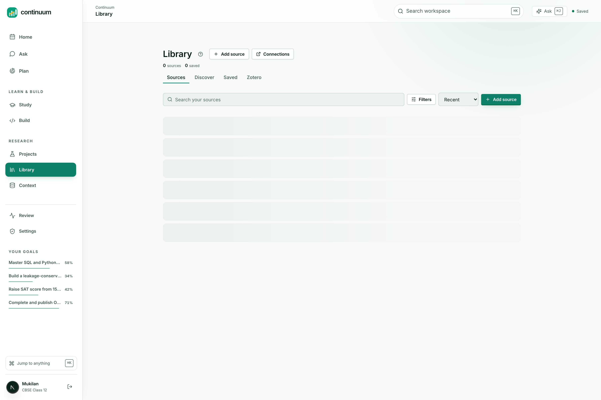
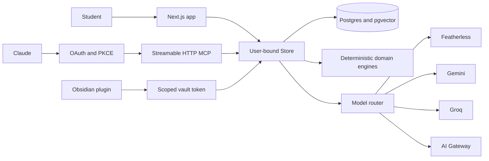

<p align="center">
  
</p>

<h1 align="center">Continuum</h1>

<p align="center">
  <strong>A study and research workspace where the AI already knows your work.</strong>
</p>

<p align="center">
  <a href="https://continuumstudy.vercel.app"><strong>Live demo</strong></a> ·
  <a href="docs/submission/devpost-story.md">The story</a> ·
  <a href="docs/submission/architecture.md">Architecture</a> ·
  <a href="docs/submission/routing.md">Model routing</a> ·
  <a href="docs/submission/prompt-engineering.md">Prompting</a> ·
  <a href="docs/submission/learning-science.md">Learning science</a>
</p>

<p align="center">
  
  
  
  
  
</p>

---

## The problem

Ask a student where their work is and you get a list, not a place.

The syllabus is a PDF in Downloads. Notes are in Notion. Papers are in Zotero.
Practice questions are in a WhatsApp group. The plan is a photo of a whiteboard.
And the AI doing the heavy lifting is a chat window that knows none of it.

So every session opens the same way: paste the syllabus, paste the notes, explain
what you already tried. Then close the tab and start from zero tomorrow.

That ritual quietly breaks three things.

**The AI is confidently wrong about you.** With no memory of your work it has to
guess what you know, so it re-explains what you understood last week and skips what
you have never seen. The failure is invisible, because the prose is fluent.

**Progress becomes unmeasurable.** Time in an app is not learning, but it is the
only signal available to a tool that never checks whether you can *do* anything. A
study tool that cannot tell recognition from recall is measuring attendance.

**Citation becomes optional.** When an AI answers from general knowledge about a
paper you uploaded, nothing in the output tells you.

| Tool | Holds | Does not know |
|---|---|---|
| Notion | Notes and structure | What you understand |
| Anki | Review scheduling | Anything about your research or sources |
| Zotero | Papers and citations | What you are trying to learn |
| ChatGPT | Reasoning | You, tomorrow |
| NotebookLM | Your sources | Your week, your goals, your misconceptions |

Each is good at its corner. None holds the whole thing, so the student becomes the
integration layer. By hand. Forever.

---

## What Continuum does

Goals, plan, sources, research and learning state live in one database, and the AI
works from that database instead of from a text box.

The interesting part is not that it has an assistant. It is what the assistant is
forbidden to do.

### 1. AI where judgment is needed. A solver where arithmetic is enough

<p align="center">
  
</p>

Building a week from deadlines, prerequisites, estimated minutes and fixed
commitments is a constraint problem with a correct answer. Hand it to a model and
you get something plausible that occasionally schedules a task before its
prerequisite.

```ts
route: "deterministic",
model: "continuum/constraint-solver-v1",
reason: "Constraints, dependencies, dates, and arithmetic are solved deterministically.",
costClass: "none",
```

`costClass: "none"`. Scheduling is free, instant, and correct.

### 2. Progress is evidence, never time

<p align="center">
  
</p>

Reading a lesson cannot move the number that means "can apply this":

```ts
if (evidence.kind === "lesson_read") {
  next.exposure = Math.max(next.exposure, 0.8);
  next.explanation = "Lesson exposure was recorded; transfer did not change because no independent evidence was provided.";
}
```

Four dimensions per concept, and mastery is a strict conjunction: four separate
pieces of evidence, high transfer to unseen problems, and retention that has
already survived a gap.

### 3. An answer cites a passage, or says it could not

<p align="center">
  
</p>

Every claim in an answer is an openable citation chip pointing at the user's own
decision, source passage, or saved note. When retrieval finds nothing, the
assistant says so rather than inventing.

That disclosure is load-bearing. It is the only reason a
[five-link grounding failure](docs/submission/grounding-and-mcp.md) was ever
findable.

---

## Model routing

There is no "the model". A pure function picks a route per task and records why.

<p align="center">
  
</p>



Evidence checking gets a second opinion from a **different vendor**, because asking
a model to check its own work with the same context in scope mostly measures its
consistency:

```ts
const provider = decision.route === "featherless" ? "ai_gateway" : "featherless";
return { provider, model: `${provider}/evidence-verifier`, freshContext: true };
```

Full policy: [docs/submission/routing.md](docs/submission/routing.md)

---

## Claude works in the same workspace

<p align="center">
  
</p>

46 MCP tools over Streamable HTTP with OAuth and PKCE, backed by the same store the
web app uses. One implementation means an external agent cannot see a different
workspace than you do.

Every scope is a separate checkbox with a plain-English name, badged read-only or
can-make-changes. Writes are proposals, not mutations:

> `save_progress_note` This cannot mark work complete: completion is a change the
> user approves in Continuum, so use `propose_change` for that.

<p align="center">
  
</p>

Every pending change lands on Review as a field-level diff. Nothing is applied
without approval.

---

## Research that keeps its provenance

<p align="center">
  
</p>

Live OpenAlex search, Zotero import, and PDF/DOCX ingestion. Saving a work indexes
its passages so answers can cite them.

<p align="center">
  
</p>

<p align="center">
  
</p>

A claim carries the exact passages that support or contradict it, each with its
evidence status and the independent route that verified it.

---

## Learning that measures the right thing

<p align="center">
  
</p>

SM-2 spaced repetition with two deliberate departures. **Recognition does not
advance the interval**, because self-report is exactly the signal that inflates:

```ts
if (!evidence.correct) return "forgot";
if (evidence.explanationScore !== undefined && evidence.explanationScore < 0.5) {
  // Right answer, cannot explain it. That is recognition, and it is exactly
  // the case a self-reported grade would call "easy".
  return "hard";
}
if (!evidence.unseen) return "hard";
```

And **a lapse costs ease but never resets the record**, so a shaky concept returns
soon without pretending it was never learned.

Every interval ships with a sentence, because a scheduler that says "review this
Tuesday" and cannot say why is asking for trust it has not earned:

```
"You had this at 12 days. Back to 6 days."
"Right, but not yet fluent, back in 4 days."
```

Full model: [docs/submission/learning-science.md](docs/submission/learning-science.md)

---

## Everything else

<table>
<tr>
<td width="50%"></td>
<td width="50%"></td>
</tr>
<tr>
<td><sub><strong>Library.</strong> Imported sources with processing state, chunk counts and retention.</sub></td>
<td><sub><strong>Build.</strong> Runtime output reaches the model as evidence, never as instruction.</sub></td>
</tr>
<tr>
<td></td>
<td></td>
</tr>
<tr>
<td><sub><strong>Command palette.</strong> One search across goals, projects, sources, passages and memory. Opening a result never changes data.</sub></td>
<td><sub><strong>Connections.</strong> Bring-your-own-key for every provider. Any connected client is revocable.</sub></td>
</tr>
</table>

---

## Architecture



One store, three consumers. The scope system is enforced once.

```
apps/
  web/              Next.js 15.5 App Router, React 19
  obsidian-plugin/  The same workspace from an Obsidian vault
  video/            Remotion project for the demo film
packages/
  ai/               Provider clients, routing policy, embeddings
  db/               Drizzle schema, migrations, seeds
  domain/           Pure logic: mastery, spaced repetition, scheduling
  mcp/              46 tools with scopes and classes
  retrieval/        Vector and lexical primitives
  schemas/          Zod schemas shared across every boundary
```

`packages/domain` imports no database client, makes no network call, and calls no
model. That is what makes the mastery model testable as mathematics rather than as
behaviour observed through three layers of I/O.

| | |
|---|---|
| Tables | 67 |
| API routes | 51 |
| MCP tools | 46 |
| Tests | 1,117 across 71 files |
| Embeddings | 1536-dim, HNSW over `vector_cosine_ops` |

Full detail: [docs/submission/architecture.md](docs/submission/architecture.md)

---

## Running it

```bash
pnpm install
cp .env.example .env.local     # DATABASE_URL is the only required value
pnpm db:migrate
pnpm seed:demo
pnpm dev
```

```bash
pnpm test          # 1,117 unit and component tests
pnpm test:e2e      # Playwright
pnpm build
```

Zero-credential local mode uses an explicitly labelled in-memory development
identity. With no model keys configured, the router degrades honestly rather than
routing to a provider that cannot answer.

---

## What this project taught

**Good empty states hide bugs.** A well-designed "nothing here yet" is
indistinguishable from a broken retrieval leg, a missing view field, or an
unimported stylesheet. Every serious defect in this codebase failed as an
*absence*, never as an exception. So the tests assert that a specific thing **is**
retrieved, not that retrieval did not throw.

**Honest disclosure is a debugging tool.** The only reason the grounding failure
was findable is that the assistant said out loud it had answered from general
knowledge. A system that hid its uncertainty would have shipped a confident,
invented answer for months.

**Prompt rules need their reasons beside them.** A rule with no recorded failure
behind it is a rule the next person deletes when it looks redundant.

Verification approach: [docs/submission/evaluation.md](docs/submission/evaluation.md)

---

<p align="center">
  <strong><a href="https://continuumstudy.vercel.app">Try the demo</a></strong><br>
  <sub>Click "Explore the demo". No signup.</sub>
</p>

<p align="center">
  <sub>Then ask it: <em>"Why can't OASIS claim single-cell co-expression?"</em><br>
  It cites the passage.</sub>
</p>
