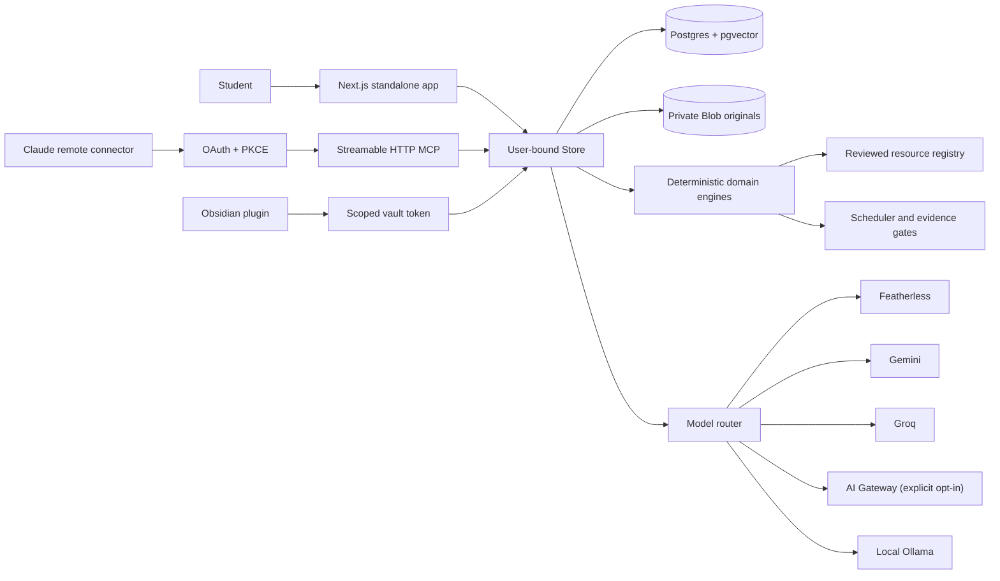

# Architecture

Continuum has one canonical user-scoped state shared by the web app, Claude through remote MCP, and the optional Obsidian connector.

## Canonical state

Postgres stores accounts, goals, tasks, projects, learning states, sources and passages, research notes/decisions/claims/evidence, schedule blocks, resource activities, proposals, model route records, OAuth grants, audit events, memory chunks, summaries, and outcome receipts.

Every repository read that exposes user data includes an ownership predicate. Foreign-key references supplied by clients are additionally checked against the authenticated user before a write. The process-local Store exists only for the explicit zero-credential development workspace; production environment validation requires the database.

## Memory pipeline

Meaningful writes append immutable `memory_events` and `audit_log` rows. Current values live in structured domain tables and non-superseded `memory_records`. Compact `memory_chunks` omit raw transcripts and full documents, carry source-event IDs and timestamps, and can hold a 1536-dimensional embedding.

`load_context` combines bounded current state with relevant durable chunks. `search_memory` uses PostgreSQL full-text ranking and, when configured, pgvector cosine similarity, importance, and recency. The response is pruned as valid structured JSON to the caller’s requested token budget. Every production context load records selected memory IDs and an estimated token count in `context_access_log`.

## Write safety

Low-impact checkpoints and explicitly initiated standalone-app writes can commit directly. MCP changes to goals, projects, tasks, or schedules create expiring proposals. `confirm_proposal` applies only whitelisted goal/project/task fields. Schedule confirmation deliberately does not mutate blocks; `commit_schedule_change` requires a separate scope and fresh confirmation metadata.

Research claims created by assistants are always `unverified`. Evidence links must resolve to exact, user-owned source passages. Reading content or opening a resource cannot increase transfer mastery.

## Resource lifecycle

The broker evaluates reviewed native and external resources in deterministic code. A chosen activity is persisted before navigation. Return and verification are distinct states. Automatically checkable evidence can update mastery; self-reported scores, artifacts, and non-machine-checkable work remain `needs_review`. A passing check produces an outcome receipt and a real spaced follow-up block linked to the original goal.

## Provider boundaries

Provider credentials exist only in server environment variables. Featherless routing inspects the live plan and eligible model catalog unless an operator pins a model; reviewed task models remain available when catalog discovery is degraded. Groq validates task models against the authenticated project catalog. Gemini keys are deduplicated, capped at ten, and round-robin selected; Gemini is disabled until the operator acknowledges the data-use choice. AI Gateway is disabled unless the operator explicitly accepts metered routing. Ollama browser mode allows loopback endpoints only. Structured model output is schema-validated before use.

## Deployment boundary

Source code can implement these paths, but a deployment is not operational until HTTPS origin variables, database migrations, provider secrets, private Blob if desired, and the Claude account-side connector are configured and verified. ChatGPT MCP remains future scope.
