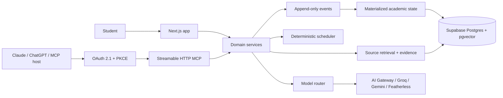

# Architecture

Continuum is a TypeScript monorepo with one deployable Next.js 15 application and replaceable domain adapters.

## Trust boundaries

1. Browser code receives only public Supabase configuration and typed app data.
2. Next.js Node routes own provider keys, service credentials, OAuth signing, source parsing, and authorization.
3. Retrieved documents cross an untrusted-data boundary: embedded instructions are removed or marked before context assembly.
4. MCP calls cross a separate client boundary: tokens are per-user, short-lived, scoped, and revocable.
5. Deterministic code owns constraints, dates, arithmetic, state transitions, permissions, and validation.

## Event-to-view flow

Meaningful writes append immutable `memory_events` and `audit_log` entries. Projectors update `memory_records` for current mastery, current goal progress, accepted decisions, active schedule, and research state. Superseded records stay in history but are excluded from current retrieval.

## Demo adapter and production adapter

The zero-credential demo uses a seeded in-process adapter behind the same tool contracts. The Drizzle schema contains every durable table required by the PRD. Production swaps the adapter for Supabase/Postgres without changing the UI, schemas, scheduler, or MCP tool definitions.
