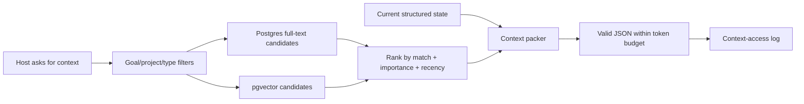

# Token-efficient persistent academic memory

Obsidian is optional storage/synchronization, not the memory engine. The canonical memory lives in Continuum’s structured database so the web app and every authorized MCP host see the same state.

## What is stored

- Structured current state: goals, deadlines, tasks, projects, decisions, learning dimensions, sources, claims, schedule blocks, resource activities, and permissions.
- Append-only durable events and audit entries.
- Compact session receipts containing work completed, decisions, concepts, misconceptions, unresolved questions, next actions, and evidence IDs.
- Bounded semantic memory chunks with timestamps, importance, entity links, source-event IDs, hashes, and optional embeddings.
- Optional entity summaries and exact source passages.

Raw chats are not the primary memory format. Replaying whole conversations is expensive and makes stale or contradictory statements difficult to supersede.

## Retrieval flow

`load_context` is for a compact resume pack. `list_projects` or `list_goals` lets the assistant show a selector before loading detail. `load_project` or `load_goal` focuses one entity. `search_memory` is the escape hatch for the rest of the account history. This exposes the full account through queryable tools without putting the full account into every prompt.

## Embeddings

The database column is fixed at 1536 dimensions. Gemini `gemini-embedding-001` requests `outputDimensionality=1536` and normalizes the reduced vector. Featherless, AI Gateway, and Ollama outputs are rejected if they do not exactly match the column.

Configured provider order controls fallback. Gemini accepts up to ten deduplicated server-side keys and cycles them, but Google quota is associated with the project rather than the number of keys. Ten keys from one project therefore improve rotation/failover handling, not the project quota.

If every embedding provider fails, Postgres full-text search still returns relevant memory and source passages. Failed embeddings can be backfilled later without losing the durable text.

## Why not use Obsidian as the primary vector database?

Obsidian is excellent as a user-owned local document surface. It is not a multi-client authorization layer, transactional academic-state database, or remote MCP store. Continuum therefore:

1. Keeps canonical state in Postgres.
2. Lets the user push selected or whole-vault documents into Continuum.
3. Indexes readable content for retrieval and optionally stores originals privately.
4. Pulls generated current context, projects, and outcome receipts back into a marked `Continuum/` area.
5. Keeps the vault optional; Claude MCP and the web app continue to work without it.

## Token discipline

- Prefer selector tools before detail tools.
- Use caller-controlled `maxTokens` and narrow goal/project filters.
- Store results and decisions, not chain-of-thought or entire chats.
- Save one `sync_session` receipt when useful work ends.
- Let source passage tools fetch exact evidence only when a claim needs it.
- Do not invoke `route_specialist_task` when the host can do the task itself.
