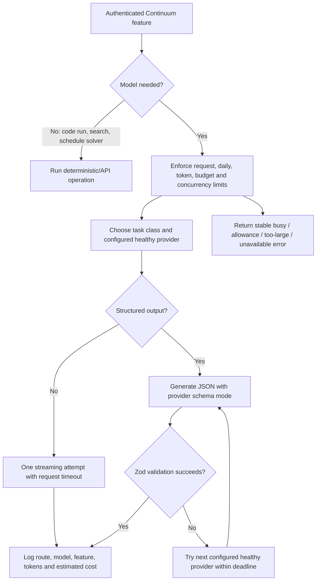

# Continuum model routing

This document describes the code that is running, not an aspirational model list.
The authoritative implementation is split across:

- `packages/ai/src/policy.ts` — task-class policy decision.
- `packages/ai/src/providers.ts` — provider/model resolution, health ordering, structured-output attempts, and streaming.
- `packages/ai/src/featherless.ts` — the two server-only Featherless credentials, key health/backoff, plan-aware concurrency, and model selection.
- `packages/ai/src/groq.ts` and `packages/ai/src/health.ts` — catalog validation and circuit breakers.
- `apps/web/lib/ai-gateway.ts` — authentication-adjacent quotas, token limits, shared budget, caching, request leases, safe errors, and usage logging.

The browser never receives a provider credential. A user may submit a
Featherless, Groq, or Gemini key through the authenticated Connections flow;
the server validates it against a fixed official origin and encrypts it before
storage. For that user's later request, `gatewayEnvironment()` opens only the
matching encrypted credential server-side and overlays it on an isolated
request environment. It is not written to `process.env`, returned to the
browser, logged, or reused for another user.

## Routing inputs actually used

`routeTask()` currently considers task class, text/image/PDF modality,
source-locking, high-stakes status, structured-output need, and configured
providers. The gateway also considers the per-user token allowance, the shared
daily/monthly allowance, provider health, and operator allowlists/overrides.
Featherless model selection considers task class, context limit, model
availability, concurrency cost, code specialization, and the active plan.

Conversation length and file size matter indirectly: callers retrieve a bounded
context pack, `prompt-context.ts` truncates each labelled section, and the
gateway rejects an estimated input over `AI_MAX_INPUT_TOKENS`. Subscription
access is the operator's provider configuration; Continuum does not expose a
user model picker. Privacy affects provider availability: Gemini is excluded
unless `GEMINI_DATA_USE_ACKNOWLEDGED=true`.

The current router does **not** score a free-form “user-selected mode,” and it
does not let a user override a model ID. BYOK chooses the credential boundary,
not the model ID; task policy and the provider's configured/discovered model
catalog still determine the model.

## Current model IDs and override precedence

- Featherless first honors the task-specific `FEATHERLESS_*_MODEL` override,
  then a healthy live catalogue result when the endpoint is available, then
  the reviewed fallback: `Qwen/Qwen2.5-7B-Instruct` for fast extraction,
  classification, summarisation, and misconception work;
  `Qwen/Qwen2.5-Coder-32B-Instruct` for code; and
  `Qwen/Qwen2.5-72B-Instruct` for reasoning and verification.
- Groq defaults are `llama-3.1-8b-instant` (fast),
  `llama-3.3-70b-versatile` (general), `qwen/qwen3.6-27b` (reasoning),
  `openai/gpt-oss-120b` (code), and `openai/gpt-oss-20b` (verification).
  Schema-bound calls use `GROQ_STRUCTURED_MODEL` or the first enabled reviewed
  GPT-OSS structured model.
- Gemini honors `GEMINI_MODEL` only when it is live and suitable; otherwise it
  chooses a healthy generation-capable model from the runtime catalogue.
- Explicitly enabled Vercel AI Gateway uses `AI_GATEWAY_GENERAL_MODEL` or
  `google/gemini-3.5-flash`, with configured fallbacks or
  `openai/gpt-5.4` then `anthropic/claude-sonnet-4.6`.

## Routing table

Defaults below can be replaced by the corresponding server environment
variables. “Backup” means the next configured, healthy route—not a promise that
every deployment has that provider.

| Product task | Task class / primary | Backup and condition | Tools / memory / retrieved documents | Timeout and attempts | User override |
|---|---|---|---|---|---|
| General chat or MCP specialist answer | `conversational_support`; Featherless reasoning override/catalogue, curated `Qwen/Qwen2.5-72B-Instruct` fallback | Gemini, Groq, then explicitly enabled Vercel AI Gateway for structured calls | MCP tool execution remains in the host. Relevant Continuum context is included only by the calling route | Gateway deadline 30 s by default. One attempt per route | No |
| Workspace Assistant | `conversational_support`; the user's healthy BYOK route when configured, otherwise the normal Featherless-first policy | Next configured healthy provider | `load_context` plus focus-ranked account-scoped memory, not a workspace dump. Full chat is session history; only an explicitly reviewed compact memory becomes durable retrieval context | One streaming attempt; stable busy/unavailable response on failure | User can stop output and inspect/edit/exclude/delete proposed memory |
| Research search | No model. OpenAlex HTTP API, optionally Crossref | Crossref only when selected; no model fallback | Search filters only; no memory | OpenAlex request: 8 s per attempt, up to 3 bounded attempts for 429/5xx/timeouts | Source/filter selection only |
| Research synthesis | `research_synthesis`; Featherless reasoning model | Gemini, Groq reasoning, AI Gateway when configured | Bounded retrieved context; no direct model tools | One attempt per provider within the structured deadline | No |
| Paper summarisation | `summarization`; Featherless 7B fast model | Groq fast, Gemini, AI Gateway | Caller-supplied/retrieved paper content | Safe structured calls may retry once on the other healthy Featherless key | No |
| Citation extraction | `extraction`; Featherless 7B fast model | Groq structured-capable model, Gemini, AI Gateway | Source content is labelled untrusted | Schema validated with Zod; provider fallback on malformed JSON | No |
| Citation verification | `citation_entailment`; Featherless 72B verifier | A separately configured provider is required for an independent MCP verification request | Exact proposed result and evidence identifiers | High-stakes calls do not repeat the same expensive request; one attempt per route | No |
| Uploaded question-bank grading | Deterministic source-term coverage is always authoritative; two independent `citation_entailment` providers are added only for ambiguous or important answers | If fewer than two independent routes work, the result explicitly says `single_model_plus_source_rules` or `source_rules_only` | The uploaded passages and editable answer key only. Answer keys are absent from practice and initial workspace snapshots | Each verifier receives an allowlist containing exactly one provider; all other credentials are removed from that call's environment | No external verification toggle yet |
| Run code | **No model**; browser Web Worker/WASM runtime | None | No memory, retrieval, or network | Language startup has a separate 45 s ceiling; user code has a 5/10/30 s selected limit | User selects only the run-time limit |
| Explain, review, or debug code | `code_reasoning`; Featherless code override/catalogue, curated `Qwen/Qwen2.5-Coder-32B-Instruct` fallback | Gemini, Groq code model, AI Gateway for structured paths | Exact code, actual run result, and a bounded academic context pack | Streaming request deadline 30 s; no automatic repeat on failure | Provider may be Continuum or the user's local Ollama |
| Fast inline code completion | Not implemented | None | None | No background model request occurs | No |
| Mathematical reasoning | `mathematical_reasoning`; Featherless reasoning model | Gemini, Groq reasoning, AI Gateway | Context only when supplied by caller | One attempt per route in structured flow | No |
| Study-plan generation | `schedule_optimization`; deterministic constraint solver | None | Tasks, availability, fixed commitments, deadlines | No model timeout or model cost | The user edits the draft |
| Plan explanation | `plan_explanation`; Featherless reasoning model when explicitly requested | Other configured providers | The saved/draft schedule supplied by caller | Gateway deadline | No |
| Document analysis | `document_understanding`; Gemini only when data-use acknowledgement and a working model are present | No safe multimodal fallback is currently guaranteed | Selected document payload; bounded context | Gateway deadline | No |
| Vision/image analysis | `image_understanding`; Gemini under the same privacy gate | No safe vision fallback is currently guaranteed | Selected image only | Gateway deadline | No |
| Tool use | MCP host executes registered tools; a specialist model does not receive arbitrary application tools | None | Scope-filtered MCP context | Tool-specific limits | Host selects tools under OAuth scopes |
| Long-context task | Normal task class after retrieval/context compression | Normal provider order | Maximum estimated input defaults to 12,000 tokens; labelled sections have smaller caps | Rejected before billing if too large | No |
| Structured JSON | Task-class model plus provider-specific JSON Schema | Featherless → Groq structured model → Gemini → AI Gateway, filtered to configured/healthy routes | Depends on caller | Zod validation. One attempt/provider; at most two Featherless attempts only for safe fast tasks and two Gemini-key attempts | No |

Relative cost classes are `none`, `low`, and `medium` in the current policy.
There is no route that deliberately selects `high` today. When either the
user's allowance or shared $25 allowance is near its threshold, the gateway
rebinds Featherless reasoning/code selection to the configured fast/fallback
model and records the reason.

## Failure handling

- A provider-level circuit breaker moves repeatedly failing routes later.
- Featherless rotates between the least-busy healthy primary and secondary key.
  HTTP 429 backs a key off for 30 seconds; 401/403 backs it off for five minutes;
  other errors open the key after two consecutive failures.
- Safe fast structured tasks may try the other Featherless key once. Expensive
  or high-stakes tasks are not repeatedly retried.
- Malformed JSON fails Zod validation and moves to the next qualified provider.
- A too-long request is rejected before a provider call. There is no automatic
  lossy compression inside the gateway; callers must retrieve or summarise a
  smaller context.
- In-flight identical cache-safe structured requests are deduplicated. Completed
  safe results are cached per user/feature/prompt for five minutes by default.
- Every structured loop is finite: a de-duplicated provider list, bounded
  attempts per provider, and a wall-clock deadline prevent fallback cycles.
- `allowedProviders` is an execution boundary, not only a router hint. The
  request-scoped environment clears every non-allowed credential before
  generation, so the two question-bank verifiers cannot silently fall back to
  each other.
- Tokens/grants and safe-request hashes prevent duplicate OAuth consumption and
  duplicate cache-safe generation. Streaming is not automatically retried,
  because replaying a partial response could duplicate output and billing.

## Limits and observability

Defaults are six requests/user/minute, 60/user/day, 12,000 input tokens, 2,400
output tokens, four global request leases, a 30-second request timeout, 350,000
shared tokens/day, and a $25 shared monthly estimate. `AI_EMERGENCY_CUTOFF=true`
stops all model work. Successful calls log user, feature, task class, provider,
model, input/output tokens, estimated cost, verification state, and fallback
state in `model_routes` and `model_usage`.

## Local Ollama

Ollama never routes through the public Continuum backend. The browser accepts
only loopback `http(s)` origins, probes `/api/tags`, selects an installed model
under the 8 GB safety limit, then runs a small streamed `/api/chat` request.
The connection can be saved only after streamed text is observed. The UI
records first-text and total latency and distinguishes not-running,
browser/CORS blocking, timeout, incompatible endpoint, unavailable model, and
invalid-response states. The selected URL and model stay in that browser's
local storage. Code execution itself remains model-free.
