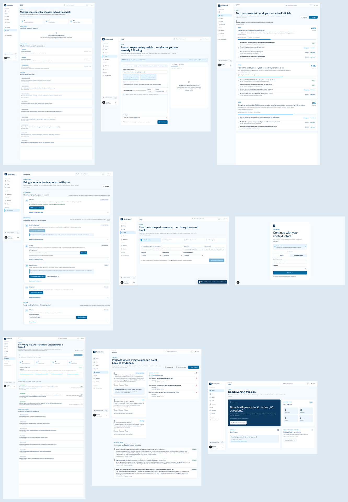
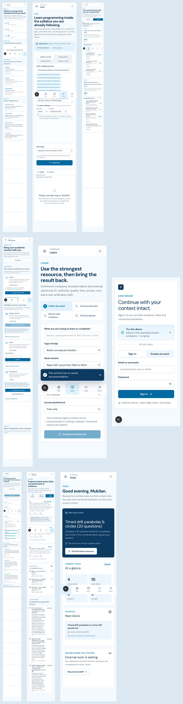

# Continuum product redesign audit

Status: baseline audit complete on 22 July 2026, before redesign code changes.

This audit is based on the seeded demo workspace rendered in Chromium through `agent-browser`, not on JSX inspection. The baseline under review is commit `53cb365350adc6262472098295962d27b99b49fe` on `audit/perf-security-fixes`.

## Test matrix

| Surface | 1440×900 | 1280×800 | 390×844 | 375×812 |
| --- | --- | --- | --- | --- |
| Login | Full-page capture | — | Full-page capture | Full-page capture |
| Today | Full-page capture | Full-page capture | Full-page capture | Full-page capture |
| Plan | Full-page capture | — | Full-page capture | — |
| Learn | Full-page capture | — | Full-page capture | — |
| Code | Full-page capture | — | Full-page capture | — |
| Research | Full-page capture | — | Full-page capture | — |
| Memory | Full-page capture | — | Full-page capture | — |
| Review | Full-page capture | — | Full-page capture | — |
| Connections | Full-page capture | — | Full-page capture | — |

Every authenticated desktop page had zero horizontal document overflow and no application runtime error in the browser console. All baseline CSS and application pages loaded correctly.

## Screenshot evidence

Desktop overview:

Mobile overview:

Key originals:

- [Today desktop](./audit-screenshots/today-1440x900.png)
- [Today mobile](./audit-screenshots/today-390x844.png)
- [Plan desktop](./audit-screenshots/goals-1440x900.png)
- [Learn desktop](./audit-screenshots/learn-1440x900.png)
- [Learn mobile](./audit-screenshots/learn-390x844.png)
- [Code desktop](./audit-screenshots/code-1440x900.png)
- [Code mobile](./audit-screenshots/code-390x844.png)
- [Research desktop](./audit-screenshots/research-1440x900.png)
- [Connections mobile](./audit-screenshots/integrations-390x844.png)

## Resolution after redesign

Status: **browser-tested** after implementation at the same 1440×900 and 390×844
targets. Final evidence is catalogued in `visual-qa.md`.

- Code is now a real three-pane workbench with deterministic execution, tests, and
  AI output separated from runtime output.
- Learn is a curriculum home plus focused lesson/checkpoint and guided-resource flow,
  with official YouTube search or an honest unconfigured handoff.
- Plan is a weekly board with Goals/Backlog views and a draft-versus-commit boundary.
- Research is project-first with Overview/Discovery/Papers/Notes/Claims/Experiments/
  Decisions/Drafts, normalized provider state, and explicit save.
- Memory prioritizes meaningful current state and stable context packs; raw events
  are secondary History.
- Review and Today use flatter strips/ledgers instead of repeated box grids.
- Shell mobile touch targets and safe-area spacing were corrected; rebuilt route
  screenshots show no document-level horizontal overflow.

## Cross-product findings

### What already works

- The restrained blue palette, sans-serif type, visible focus treatment, and quiet borders are a credible base.
- Desktop navigation is understandable and remains stable across pages.
- The seeded workspace feels lived in: tasks, research decisions, and receipts use meaningful data rather than generic placeholders.
- Semantic headings and labelled navigation are present. Normal desktop layouts do not clip or overflow.
- Login has a clear hierarchy and an honest description of the session controls.

### Problems to solve

1. **The shell is visually static.** Every workflow receives the same broad header, sidebar, pale canvas, and bordered white containers. Page identity comes mostly from a large sentence rather than from a task-appropriate workspace.
2. **The interface exposes storage structures.** Goals, sources, receipts, decisions, connections, and provider state are rendered as records. The product rarely answers “what should I do here now?”
3. **Box density is high.** Rows sit inside panels inside a pale page; status pills, metric tiles, callouts, and controls add more containers. The repeated treatment flattens hierarchy.
4. **Primary actions are inconsistent.** Page actions move between the header, inside panels, bottom-right of forms, and row ends. Several pages present many actions with nearly equal visual weight.
5. **Mobile relies on document length.** At 390px, Plan is about 4,050px tall, Code 2,018px, Research 3,179px, Memory 4,771px, Review 3,630px, and Connections 2,959px. Long records are stacked rather than reorganized into task-focused views.
6. **The fixed mobile bar can cover content.** It crosses the Today metric section, Learn form feedback, and Code controls in the captures. Toasts can occupy the same lower viewport zone.
7. **Top mobile controls are undersized.** The menu button is 36×36 and search is 40×38 at the 375px viewport. Primary touch controls should provide at least a 44×44 hit area.
8. **Empty height is confused with whitespace.** Several pages reserve large blank card areas or page tails. Useful whitespace separates ideas; these gaps look like unfinished data regions.
9. **Feedback is detached from its trigger.** Learn shows a saved-recommendation toast before a recommendation exists; it blocks lower form fields on mobile. Errors and empty states need to live beside the action they explain.
10. **Equivalent destinations are missing.** Sources, Schedule, and Settings do not have standalone routes. Sources are embedded in Research, schedule is reduced to Today/Plan fragments, and settings are mixed into Connections. These need explicit information architecture even if they stay contextual rather than becoming three new sidebar entries.

## Page findings

### Login

- The desktop card is balanced, but the page is generic and isolated from the academic product users enter.
- Security implementation language (“HttpOnly session · same-origin writes · rate limited”) reads like an engineering checklist rather than confidence-building user copy.
- Demo and account sign-in have clear priorities. Mobile fits without overflow, but the page has no context preview or concise value proof.

### Today

- The next-action panel is the strongest baseline component: it has one obvious action and useful evidence.
- “At a glance” spends a large panel on four counts that do not help the student decide what to do.
- The schedule and external-handoff panels are equal in weight even though the scheduled task is more urgent.
- On mobile, the fixed navigation bisects the metric grid. The reading order is acceptable, but the hierarchy becomes a stack of equally bordered blocks.

### Plan

- The page is a goal database report, not an academic planning surface.
- Three tall goal cards, each with repeated progress metadata and task rows, dominate the page. Today, deadlines, calendar constraints, week load, and conflicts are not visible as a coherent schedule.
- New task and new goal are presented before the user can see workload or the current week.
- Mobile stretches to roughly 4,050px and makes cross-goal prioritisation impossible. Repeated “Mark done” buttons and status pills create control noise.
- Google Calendar state is at least labelled accurately; the redesign must retain that honesty and call seeded blocks internal constraints.

### Learn

- A four-step wizard is used for an ordinary recommendation request. The student sees configuration before content.
- Six input/select controls are visible before any lesson, due review, subject, mistake, or learning progress.
- The baseline page has no learning home, natural lesson document, worked example, practice flow, or review schedule.
- On mobile, the two-column stepper becomes a boxed 2×2 grid and the fixed toast/navigation obscure fields. The dropdown sequence feels like setup rather than learning.

### Code

- The screen is a coaching request form, not a coding environment. The editor is labelled optional and explicitly says code is never executed.
- Four coaching tabs, a topic field, suggestion chips, a prompt textarea, two selectors, a large editor, and a goal selector appear before the user receives a result.
- The empty Coach pane consumes almost half the desktop workspace while Program output and Tests do not exist.
- Mobile puts more than a viewport of configuration ahead of the editor and another tall empty coaching panel after it.
- There is no deterministic runtime, stdin, stop action, output classification, tests, attempt history, saved workspace, syntax highlighting, or SQL result table.

### Research and Sources

- Existing project and decision data are useful, especially OASIS, but the home exposes project/source records rather than a research process.
- Source deletion controls appear as small isolated icons. Discovery, unresolved questions, reading queue, recent work, and newly found papers are absent.
- There is no project workspace with substantial Overview, Papers, Notes, Claims, Experiments, Decisions, Drafts, and Discovery sections.
- Sources lack normalized scholarly metadata, provider attribution, discovery filters, full-text state, DOI deduplication, and save/attach flows.
- The long decision ledger is readable on desktop but dominates mobile. Claims and evidence are not visually connected.

### Memory

- The page contains comprehensive seeded information but reads as an inventory plus raw history.
- Metric boxes and multiple record panels give preferences, knowledge, misconceptions, evidence, deadlines, and audit events similar visual weight.
- Context packs are not first-class inspectable/exportable objects.
- The 4,771px mobile page is the longest audited workflow. Recent raw events should move to Review while Memory prioritises current, retrievable knowledge.

### Review

- Auditability is a strong product trait, but the screen is a tall ledger with repeated bordered rows.
- Pending proposals, AI receipts, and durable events need clearer grouping, filters, and a chronological activity treatment.
- Empty reserved panels create a visibly unfinished bottom half on desktop and mobile.

### Connections / Settings

- The wording is generally honest: NotebookLM is a handoff, local Ollama is optional, and absent credentials are not portrayed as connected.
- Provider configuration, assistant connections, sync tools, local bridges, and product settings all share one long page.
- Dense nested cards and disclosure rows make the page feel like an admin console.
- On mobile, important status and consent copy is tiny, primary controls repeat full width, and large blank integration regions appear after conditional loading/failure states.
- Settings needs a clear boundary from Connections, even if implemented as segmented substantial sections in one route.

## Redesign priorities

1. Rebuild the shell with reliable mobile safe areas, 44px targets, responsive detail panels, and route-specific actions.
2. Replace the shared “large statement + card collection” template with purpose-built workspaces.
3. Make Code deterministic and editor-first; keep AI in a separate feedback layer.
4. Replace Learn’s wizard with a learning home and a scrolling lesson/practice document.
5. Turn Plan into a week-oriented task surface with contextual task details.
6. Introduce a research project workspace and provider-neutral paper discovery; keep Sources contextual and searchable.
7. Make context packs and meaningful state the centre of Memory; keep raw events in Review.
8. Separate user-facing connection status from provider/admin configuration.
9. Add in-place loading, error, and recovery states, then verify every major state visually at desktop and mobile widths.
