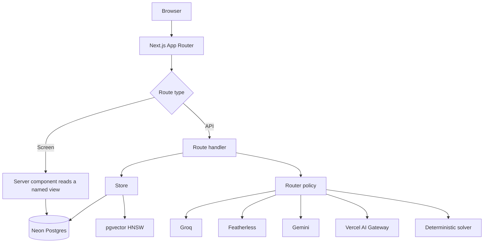

# Architecture

Continuum is a pnpm/Turborepo monorepo on Vercel, backed by Neon Postgres with
pgvector. This describes what exists and why each boundary sits where it does.

Live: https://continuumstudy.vercel.app

## Repository layout

```
apps/
  web/              Next.js 15.5 App Router, React 19. The product.
  obsidian-plugin/  Reads and writes the same workspace from an Obsidian vault.
  video/            Remotion project for the demo film.
packages/
  ai/               Provider clients, routing policy, embeddings, health checks.
  db/               Drizzle schema, migrations, seed and demo-seed.
  domain/           Pure logic: mastery, spaced repetition, scheduling, permissions.
  mcp/              MCP server definition: 46 tools with scopes and classes.
  retrieval/        Vector and lexical retrieval primitives.
  schemas/          Zod schemas shared across every boundary.
```

The split is not cosmetic. `packages/domain` holds every function that decides
something about a learner, and it imports no database client, makes no network
call, and calls no model. That is what makes the mastery model and the review
scheduler testable as mathematics rather than as behaviour observed through three
layers of I/O.

## Data model

67 tables. The ones that carry the product's claims:

| Table | Holds | Why it matters |
|---|---|---|
| `learning_states` | Four mastery dimensions per concept, plus `interval_days`, `ease`, `reps`, `lapses` | One row is both what a learner knows and when to show it again |
| `source_chunks` | Passage text, `content_hash`, `vector(1536)` | The unit a citation points at |
| `memory_chunks` | Durable memory with `importance`, `occurred_at`, `superseded` | What the assistant recalls across sessions |
| `claim_evidence` | Claim to chunk, with `status` and `verifier_route_id` | A research claim carries the passages that support or contradict it |
| `memory_events` | Append-only event log | Records are projections; events are the truth |
| `question_bank_attempts` | Per-attempt score and completion time | Feeds the review schedule |
| `assistant_sessions` / `assistant_messages` | Threads, pinning, archiving | Conversation history retrieval can read |
| `session_receipts` | What a session accomplished, with evidence ids | How an external agent hands work back |

Both embedding columns are 1536-dimensional and indexed with HNSW over
`vector_cosine_ops`. The dimension is asserted at write time:

```ts
if (values.some((value) => value.length !== dimensions))
  throw new Error(`Embedding model output must be ${dimensions}-dimensional to match the pgvector column`);
```

A provider swap that silently changes dimensionality is a failure that otherwise
surfaces months later as quietly bad search results rather than as an error.

### Events before records

`memory_events` is append-only. `memory_records` are projections carrying a
`superseded` flag, and `entity_summaries` hold an `event_watermark` so a summary
knows how much history it has seen. Nothing is destructively updated. When the
assistant proposes a change, the proposal is a row; approving it writes a new
event rather than mutating the old one.

That is why the Review screen can show a field-level diff of every pending change,
and why `whats_changed` can answer "what happened since this timestamp" without a
dedicated changelog table.

## Request path



51 API route handlers. Every screen reads through a named view rather than
querying tables directly, and `tests/view-contract.test.ts` asserts a screen never
reads a field its view does not return. That test exists because four panels once
rendered permanently empty: the component asked for a field, the view never
returned it, and an empty array renders as a well-designed "nothing here yet"
which is indistinguishable from the truth.

## The store boundary

`apps/web/lib/store.ts` is the only thing that talks to the database on behalf of
a request, and it exposes the same surface to three consumers:

1. The web app's server components and route handlers.
2. The MCP server, so Claude or any MCP client sees exactly the app's data.
3. The Obsidian plugin.

One implementation means an external agent cannot see a different workspace than
the user does, and the scope system is enforced once. Every MCP tool declares a
`requiredScope` and a `class` of `read` or `write`, and write tools route through
a proposal rather than mutating directly:

```ts
tool({
  name: "save_progress_note",
  description: "... This cannot mark work complete: completion is a change the
    user approves in Continuum, so use propose_change for that.",
  requiredScope: "memory:write",
  class: "write",
})
```

## Retrieval

Two HNSW cosine indexes: `source_chunks.embedding` for imported documents,
`memory_chunks.embedding` for durable memory.

Vector and lexical search race rather than lexical running on vector failure:

```ts
const [vectorHits, perTerm] = await Promise.all([vector, lexical]);
if (vectorHits.length) return vectorHits;
// round-robin across terms so one common word cannot fill the set alone
```

Awaiting the embedding and only falling back on an exception means a slow but
successful embedding spends the whole deadline, the deadline fires, and the leg
returns empty. That is a latency spike wearing the costume of an empty library.
Racing makes the failure mode "slower but correct" rather than "fast and wrong".

`searchSourceChunksLexical` is a passage-only query. The general `searchResearch`
concatenates claims, decisions, notes, and passages in that order and then slices,
so asking it for six results on a term that also appears in a decision returns six
decisions and zero passages. It was structurally incapable of returning the thing
it was being used to return.

## Deadlines and degradation

The assistant's four retrieval legs run concurrently under explicit deadlines:

```ts
export const DEADLINES = {
  classification: 1_500,
  retrieval: 2_000,
  sources: 3_500,
  pageContext: 300,
} as const;
```

A leg that misses its deadline contributes an empty array and appends to a
`degraded` list that reaches the user as a disclosure. The assistant says
"Answered from general knowledge, nothing in your workspace matched" rather than
answering confidently from nothing. That disclosure is the only reason a
five-link retrieval failure was ever findable, documented in
`docs/retrieval-chain.md`.

## Testing

1,117 unit and component tests across 71 files, plus Playwright end-to-end,
accessibility, responsive, and visual specs.

Three test families are unusual enough to name:

`tests/view-contract.test.ts` asserts the screen-to-view contract; that the
passage-only query exists and is what the assistant's lexical fallback calls; that
read endpoints do not statically import write-path dependencies; and that every
component owning a namespaced class family imports the stylesheet defining it.
That last assertion exists because `concept-map.tsx` imported no stylesheet at
all. Its rules live in `study.css`, so the concept map rendered correctly on
`/learn` and `/study` and rendered as bare inline text on the goal page it was
built for.

`tests/design-tokens.test.ts` holds `globals.css` under a 600-line ceiling and
asserts every co-located stylesheet composes tokens rather than literal colours.

`tests/demo-seed.test.ts` asserts the seeded demo is internally consistent, for
instance that the question-bank set scoring lowest is the one whose concept has
the most lapses.

## Deployment

Vercel, region `sin1`, Fluid Compute. Neon Postgres with pgvector. `sharp` and the
PDF and DOCX parsers sit behind lazy loaders, because a static import failure in a
serverless bundle takes down every export in the file. `sharp` failing to `dlopen`
on linux-x64 once returned a 500 HTML page from `/api/sources`, which the Library
rendered as "We couldn't load your sources".
