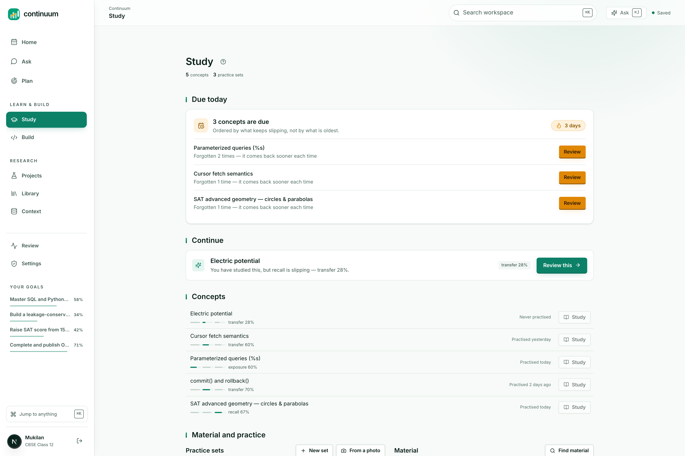
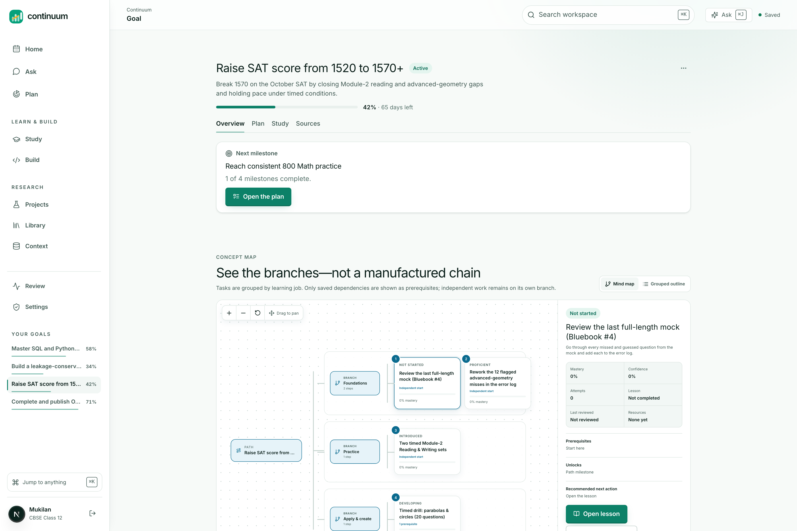

# Learning science

The pedagogy in Continuum is code, not copy. Every function here lives in
`packages/domain`, which imports no database client and calls no model, so each
rule below is unit tested as arithmetic.

## Mastery is four numbers, not one

A single "progress" percentage cannot distinguish a learner who has read a page
from one who can apply the idea to a problem they have never seen. Continuum
tracks four dimensions per concept in `learning_states`:

| Dimension | What raises it |
|---|---|
| `exposure` | Reading a lesson or completing a resource |
| `understanding` | Guided practice, with diminishing returns |
| `transfer` | Correct answers to **unseen** checkpoints |
| `retention` | Holding up over time, decaying between reviews |

Plus `confidence`, tracked separately and never mixed into the others, because the
gap between confidence and transfer is itself the useful signal.


<p align="center">
  
</p>

<p align="center"><sub>Mastery per concept, with the evidence behind it rather than a time-based percentage.</sub></p>

### Reading never raises transfer

```ts
if (evidence.kind === "lesson_read") {
  next.exposure = Math.max(next.exposure, 0.8);
  next.status = current.status === "misconception_detected" ? current.status : "exposed";
  next.explanation = "Lesson exposure was recorded; transfer did not change because no independent evidence was provided.";
}
```

This is the rule most study tools get wrong. Time spent is not learning, and a
progress bar that fills as you scroll is measuring scrolling. Here, `transfer` is
untouched by exposure, and the state carries a written explanation of why.

### Retention decays with time, not with use

$$r' = \mathrm{clamp}\left(r - \min(0.18,\; 0.008 \cdot \Delta t_{\text{days}})\right)$$

```ts
const days = (reviewTime - previousReview) / 86_400_000;
next.retention = clamp(current.retention - Math.min(0.18, days * 0.008));
```

Roughly 0.8 percentage points per day, capped at 18 points per gap so a long
absence does not zero a concept that was genuinely learned.

### Unseen evidence, weighted by quality

When an unseen checkpoint is passed with $s \ge 0.7$:

$$q = s \cdot c \cdot (0.7 + 0.3 d) \cdot h \cdot \mathrm{dim}$$

$$t' = \mathrm{clamp}(t + 0.08 + 0.24 q), \qquad r' = \mathrm{clamp}(r + 0.05 + 0.13 q)$$

where $s$ is score, $c$ completeness, $d$ difficulty, $h$ a hint penalty of
$0.68$ when a hint was used, and $\mathrm{dim}$ a diminishing-returns factor:

$$\mathrm{dim} = \max\left(0.55,\; 1 - 0.035 \cdot \max(0,\, n - 2)\right)$$

for $n$ prior pieces of evidence. The tenth correct answer on the same concept
moves the needle less than the third, which is what you want from a system trying
to decide whether to move on.

### Mastery is a conjunction, and it is strict

$$\text{mastered} \iff n \ge 4 \;\wedge\; t \ge 0.78 \;\wedge\; r \ge 0.68 \;\wedge\; u \ge 0.8$$

```ts
const repeatedEvidence = next.evidenceIds.length >= 4;
next.status = repeatedEvidence && next.transfer >= 0.78 && next.retention >= 0.68 && next.understanding >= 0.8
  ? "mastered" : "practicing";
```

Four separate pieces of evidence, high transfer, and retention that has survived
a gap. One good day does not produce "mastered".

### Failure names a misconception rather than lowering a score

```ts
} else {
  next.transfer = clamp(next.transfer - (0.04 + 0.08 * (1 - score)));
  next.status = "misconception_detected";
  next.explanation = "The unseen checkpoint exposed a persistent misconception; targeted review was scheduled.";
}
```

`misconception_detected` is sticky: later exposure and practice cannot silently
clear it, because the status guard preserves it. It clears when the learner passes
an unseen checkpoint on the thing they got wrong.


<p align="center">
  
</p>

<p align="center"><sub>Concepts, prerequisites and what each one unlocks, with mastery and confidence shown separately.</sub></p>

## Spaced repetition: SM-2 with two departures

The file opens by stating the gap it closed:

> Continuum already measured mastery in four dimensions and then scheduled nothing
> with it, which left a student with a number and no answer to the only question
> that matters day to day: *what should I review now?*

### Departure 1: recognition does not advance the interval

Standard SM-2 takes a self-reported grade from 0 to 5. Self-report is exactly the
signal that inflates: a learner who has just re-read a page feels fluent and
grades themselves 5.

Here the grade is derived from evidence:

```ts
export function gradeFrom(evidence: {
  correct: boolean;
  unseen: boolean;
  explanationScore?: number;   // 0-1 from an explain-back attempt
  seconds?: number;
}): ReviewGrade {
  if (!evidence.correct) return "forgot";
  if (evidence.explanationScore !== undefined && evidence.explanationScore < 0.5) {
    // Right answer, cannot explain it. That is recognition, and it is exactly
    // the case a self-reported grade would call "easy".
    return "hard";
  }
  if (!evidence.unseen) return "hard";
  if (evidence.seconds !== undefined && evidence.seconds > 90) return "good";
  if (evidence.explanationScore !== undefined && evidence.explanationScore >= 0.85) return "easy";
  return "good";
}
```

A correct answer to a question already met is capped at `hard`. It moves the
schedule forward because the memory is real, but it never earns the long interval
that only transfer to a new item justifies. Correct but slow is `good`, not
`easy`. Correct but unable to explain is `hard`.

### Departure 2: a lapse costs ease but never resets the record

Standard SM-2 sends a lapsed card back to a one-day interval and discards
everything learned about it. That is punishing and it throws away information.

$$I' = \max(1,\; \mathrm{round}(I/2))$$

The interval halves and the ease drops, so a shaky concept returns soon without
pretending it was never learned.

### The schedule

$$e' = \mathrm{clamp}(e + \delta_g,\; 1.3,\; 3.2), \qquad
\delta = \begin{cases}
-0.24 & \text{forgot} \\
-0.14 & \text{hard} \\
0 & \text{good} \\
+0.12 & \text{easy}
\end{cases}$$

$$I' = \begin{cases}
1 & \text{reps} = 1 \\
3 & \text{reps} = 2 \\
\mathrm{clamp}(\mathrm{round}(I \cdot e' \cdot m_g),\; 1,\; 180) & \text{otherwise}
\end{cases}
\qquad m = \begin{cases} 0.6 & \text{hard} \\ 1 & \text{good} \\ 1.15 & \text{easy} \end{cases}$$

The 180-day ceiling has a stated reason: beyond that, a scheduled review is
indistinguishable from "you know it".

### Every interval carries a sentence

```ts
export interface ReviewOutcome extends ReviewState {
  dueAt: string;
  /** Plain language, for the UI. Never a number without a reason beside it. */
  because: string;
}
```

Which produces, from real state:

```
"You had this at 12 days. Back to 6 days."
"Right, but not yet fluent - back in 4 days."
```

A scheduler that says "review this on Tuesday" and cannot say why is asking for
trust it has not earned.

## Explain-back

`explanationScore` in the grader comes from the explain-back surface: the learner
writes the idea in their own words and the grading distinguishes a correct answer
from a correct answer they can reconstruct. That distinction is what separates
`hard` from `easy` above, and it is the difference between recognition and recall
that self-report cannot see.

## Grading is conservative by construction

The question-bank grader runs a deterministic comparison first and only calls a
model when the answer is genuinely ambiguous. When it does, reconciliation is
asymmetric:

```ts
const confirmed = deterministicCanConfirm(answer, expected) || (single ? single.verdict === "correct" : false);
const downgrade = deterministic.correct && !confirmed;
```

A single evaluator may lower a deterministic pass. It may never award one. This
exists because the grader once marked a textbook misconception "Correct": a model
was willing to be generous about parameter order, and a student would have walked
away with the error confirmed. Being conservative about a right answer costs a
learner one extra review. Being wrong about a misconception costs them the
concept.
