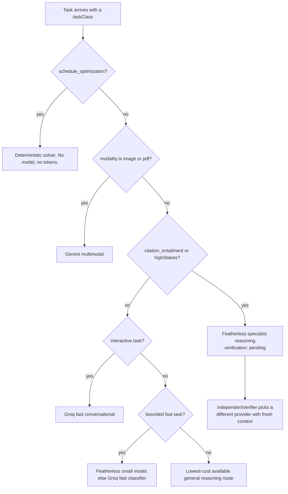

# Model routing

Continuum does not have "an AI model". It has a router that picks a route per
task from the task's own requirements, and one of the routes runs no model at all.

The whole policy is in `packages/ai/src/policy.ts` and it is a pure function:
`routeTask(request) -> RouteDecision`. It touches no network, so every branch is
unit tested, and the decision it returns is stored so a user can see why a given
answer was produced the way it was.

## The decision



## Why each branch exists

### Scheduling runs no model

```ts
const deterministicTasks = new Set<RouteDecision["taskClass"]>(["schedule_optimization"]);
// ...
route: "deterministic",
model: "continuum/constraint-solver-v1",
reason: "Constraints, dependencies, dates, and arithmetic are solved deterministically.",
verification: "not_required",
costClass: "none",
```

Building a week from deadlines, task dependencies, estimated minutes and fixed
calendar commitments is a constraint problem with a correct answer. A language
model asked to do it will produce something plausible that occasionally double
books you or schedules a task before its prerequisite. The solver either satisfies
the constraints or reports which one it could not.

This is the branch most worth arguing about, because the fashionable answer is to
let the model do it. Continuum's position is that AI should be used where judgment
is needed and refused where arithmetic is enough. `costClass: "none"` is the point:
scheduling is free, instant, and correct.

### Latency is a routing input, not an afterthought

```ts
/** Tasks where a person is waiting on the first token. */
const interactiveTasks = new Set<RouteDecision["taskClass"]>(["conversational_support"]);
```

The comment above `fastTasks` records what this fixed:

> `conversational_support` belongs here. It was falling through to the general
> branch, which selects the reasoning model, so an assistant turn as short as "hi"
> was answered by a 72B model on a four-unit concurrency plan and took about half
> a minute.

Featherless queues against a small shared concurrency pool. Groq answers a short
turn in well under a second. So the interactive branch prefers Groq and falls back
to the small shared model when Groq is not configured. A chat turn that genuinely
needs depth arrives as `research_synthesis` from Deep mode instead, and takes the
reasoning route.

### Evidence checking gets an independent verifier

```ts
if (request.taskClass === "citation_entailment" || request.highStakes) {
  if (available.has("featherless")) return routeDecisionSchema.parse({
    route: "featherless",
    model: "featherless/specialist-reasoning",
    reason: "Research-critical evidence checking needs strong reasoning and an independent verifier.",
    sourceMode: "retrieval",
    verification: "pending",
    costClass: "medium",
  });
}
```

`verification: "pending"` is a promise the system then keeps:

```ts
export function independentVerifier(decision: RouteDecision) {
  if (decision.verification !== "pending") return undefined;
  const provider = decision.route === "featherless" ? "ai_gateway" : "featherless";
  return { provider, model: `${provider}/evidence-verifier`, freshContext: true } as const;
}
```

The verifier is deliberately a different provider with `freshContext: true`. Asking
the same model to check its own work with the same context in scope mostly
measures its consistency. Asking a different model, given only the claim and the
passage, measures whether the passage actually entails the claim.

This is what stands behind the claim on a `claim_evidence` row: the table stores
`verifier_route_id`, so a supported claim records which independent route
supported it.

### Fallback preserves independence

```ts
export function fallbackRoute(decision: RouteDecision, failedProvider: string): RouteDecision {
  const fallback = decision.route === "groq" ? "featherless"
    : decision.route === "featherless" ? "ai_gateway" : "groq";
  return routeDecisionSchema.parse({
    ...decision,
    route: fallback,
    model: `${fallback}/fallback`,
    reason: `${failedProvider} was unavailable; the next qualified independent provider was selected.`,
    fallbackUsed: true,
  });
}
```

`fallbackUsed: true` is carried on the decision rather than dropped, so a
degraded answer is legible after the fact.

## The declared policy

The same rules are expressed as data, which is what the Context screen renders:

```yaml
classification:
  prefer: featherless/catalog-small-fast
  max_latency_ms: 2500
  verify: false
lesson_generation:
  prefer: featherless/catalog-mid-reasoning
  retrieval_required: true
  verify_if_source_locked: true
citation_entailment:
  prefer: featherless/specialist-reasoning
  retrieval_required: true
  independent_verifier: true
image_understanding:
  require: multimodal
schedule_optimization:
  provider: deterministic
```

## Providers

Four model providers plus the deterministic route. Every model id is an
environment variable rather than a literal, so a route is retargeted by
configuration:

```
AI_GATEWAY_GENERAL_MODEL, AI_GATEWAY_MULTIMODAL_MODEL, AI_GATEWAY_FALLBACK_MODELS
FEATHERLESS_MODEL, FEATHERLESS_FAST_MODEL, FEATHERLESS_REASONING_MODEL,
FEATHERLESS_CODE_MODEL, FEATHERLESS_VERIFIER_MODEL, FEATHERLESS_FALLBACK_MODEL
GROQ_MODEL, GROQ_FAST_MODEL, GROQ_REASONING_MODEL, GROQ_CODE_MODEL,
GROQ_VERIFIER_MODEL, GROQ_STRUCTURED_MODEL
GEMINI_MODEL
```

`availableProviders` is passed into `routeTask`, so the policy degrades honestly
on a deployment where only one key is configured rather than routing to a provider
that cannot answer.

## Embeddings

Embeddings have their own provider chain with the same shape: Gemini
(`gemini-embedding-001`), Featherless (`Qwen/Qwen3-Embedding-8B`), Ollama for a
fully local setup, or the gateway. Dimensionality is validated on every call
against the pgvector column width, and `gemini-embedding-001` output is normalized
when the requested dimensionality is not its native 3072.

Bring-your-own-key is real: a user can supply their own OpenAlex, Gemini, Groq,
Featherless, or Zotero credentials in Settings, stored encrypted in the
`integrations` table. When a saved credential can no longer be decrypted the API
returns a 502 with an explicit message and the UI offers reconnect and retry
rather than rendering an empty list.

## Grading is not a single model call

The question-bank grader is the clearest case of routing as a correctness
mechanism rather than a cost mechanism.

A deterministic comparison runs first. If the answer is unambiguous, that is the
result and no model is called. `needsDualVerification` decides when a model is
needed at all, and when two independent evaluators are required.

Reconciliation is asymmetric. A single evaluator may lower a deterministic pass,
but may never award a pass on its own:

```ts
const confirmed = deterministicCanConfirm(answer, expected) || (single ? single.verdict === "correct" : false);
const downgrade = deterministic.correct && !confirmed;
```

This asymmetry is the fix for a specific failure: the grader once marked a
textbook misconception "Correct" because a model was willing to be generous about
parameter order. Under this rule, an answer is only marked correct when the
deterministic check can confirm it or the evaluators agree, and any single
evaluator can pull a pass down. Being wrong about a misconception is much more
expensive than being conservative about a right answer.

The tokenizer keeps symbol-bearing tokens, because dropping them turned `x^2` and
`x2` into the same string:

```ts
const MEANINGFUL_SYMBOL = /[%=^√π°µ×÷<>≤≥≠+*/\\-]/;
```
